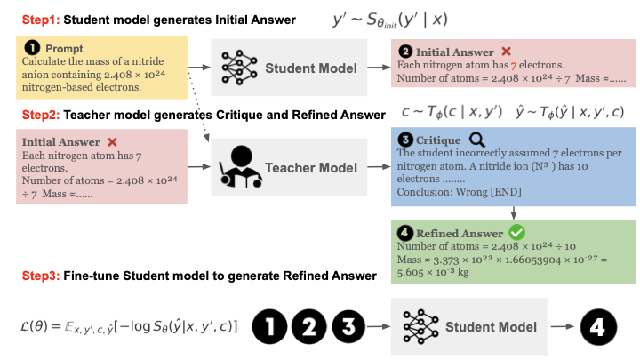
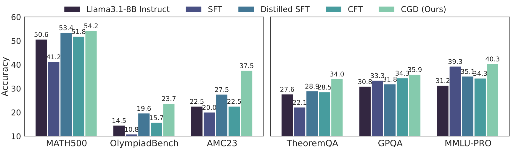
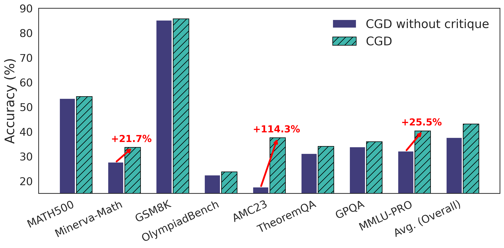
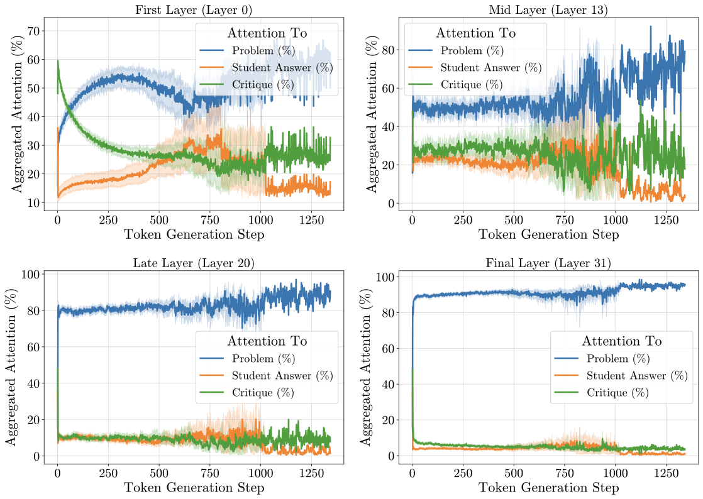
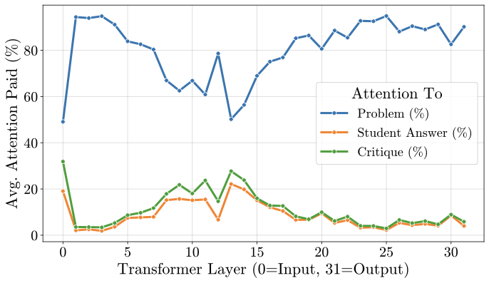
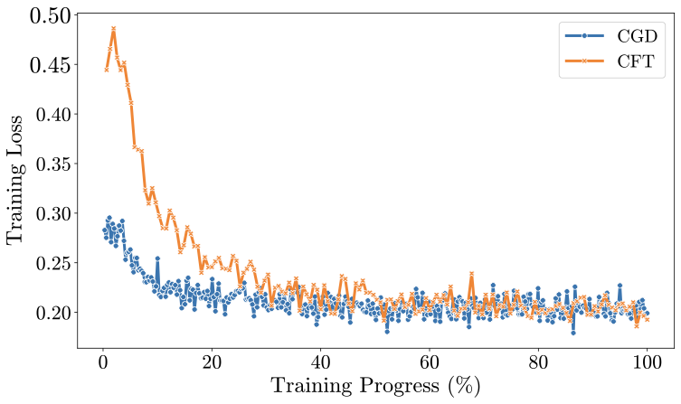

# Critique-Guided Distillation (CGD)

**Critique-Guided Distillation for Robust Reasoning via Refinement**

<a target="_blank" href="https://arxiv.org/abs/2505.11628">
</a>
<a target="_blank" href="https://github.com/CapitalOne-Research/Critique-Guided-Distillation">
</a>

<br>

> **TL;DR:** CGD trains student models to *use* teacher critiques during training (but not at inference), achieving stronger reasoning than standard distillation and Critique Fine-Tuning (CFT) with no architectural inference overhead.

---

## News

- **[2026/05]** Accepted to **ICML 2026**!
- **[2025/05]** Paper, code, and data released.

---

## Abstract

Supervised fine-tuning with expert demonstrations often produces models that imitate outputs without internalizing the reasoning processes needed for robust generalization. We propose **Critique-Guided Distillation (CGD)**, a training framework that *decouples critique consumption from critique generation*. During fine-tuning, the student is trained to refine flawed responses conditioned on teacher critiques. CGD treats critiques as a *training-time-only* supervision signal: critiques guide learning but are absent at inference. Across five model families, CGD consistently outperforms CFT and standard distillation on mathematical reasoning benchmarks, yielding 7% average improvements and gains of up to **+15.0% on AMC23** and **+12.2% on MATH-500**. Importantly, CGD preserves general instruction-following capabilities where CFT degrades significantly (**-21.3% on IFEval**).

---

## How It Works

CGD creates a powerful training signal by teaching the student model to refine its own work:

1. **Probe:** The student model generates an initial answer to a prompt.
2. **Critique:** A stronger teacher model critiques the student's answer, identifying errors and suggesting improvements.
3. **Refine:** The teacher model writes a refined answer based on the prompt, student attempt, and its own critique.
4. **Fine-Tune:** The student is trained to map *(prompt, student answer, critique) &rarr; refined answer*. At inference, only the prompt is provided---the model generates refined answers directly in a single pass.

<p align="center">
  
</p>

<p align="center">
  
</p>

---

## Main Results

### WebInstruct Fine-Tuning: LLaMA 3.1-8B & S1.1-3B

CGD consistently outperforms SFT, Distilled SFT, and CFT across both math and general reasoning tasks.

**LLaMA3.1-8B Instruct** (Teacher: LLaMA3.3-70B Instruct):

| Method | MATH500 | Minerva-Math | GSM8K | OlympiadBench | AMC23 | **Avg. (G1)** | TheoremQA | GPQA | MMLU-PRO | **Avg. (G2)** |
|---|---|---|---|---|---|---|---|---|---|---|
| LLaMA3.1-8B Instruct | 50.6 | 33.5 | 85.3 | 14.5 | 22.5 | 41.3 | 27.6 | 30.8 | 31.2 | 29.9 |
| + SFT | 41.2 | 24.6 | 80.7 | 10.8 | 20.0 | 35.5 | 22.1 | 33.3 | 39.3 | 31.6 |
| + Distilled SFT | 53.4 | 32.7 | 85.3 | 19.6 | 27.5 | 43.7 | 28.9 | 31.8 | 35.1 | 31.9 |
| + CFT | 51.8 | 32.7 | 84.8 | 15.7 | 22.5 | 41.5 | 28.2 | 34.3 | 34.2 | 32.4 |
| + CFT* (GPT-4o) | **54.8** | 33.1 | **86.2** | 18.2 | 25.0 | 43.5 | **35.0** | 30.3 | **40.8** | 36.4 |
| **+ CGD (ours)** | 54.2 | **33.6** | 85.7 | **23.7** | **37.5** | **46.9** | 34.0 | **35.9** | 40.3 | **36.7** |
| **Delta (CGD - CFT)** | +2.4 | +0.9 | +0.9 | +8.0 | **+15.0** | **+5.4** | +5.8 | +1.6 | +6.1 | **+4.3** |

**S1.1-3B** (Teacher: S1.1-32B):

| Method | MATH500 | Minerva-Math | GSM8K | OlympiadBench | AMC23 | **Avg. (G1)** | TheoremQA | GPQA | MMLU-PRO | **Avg. (G2)** |
|---|---|---|---|---|---|---|---|---|---|---|
| S1.1-3B | 54.0 | 16.9 | 76.8 | 20.6 | 30.0 | 35.4 | 21.6 | 16.7 | 13.7 | 17.9 |
| + SFT | 55.4 | 18.8 | 76.8 | 19.6 | 30.0 | 40.1 | 22.8 | 29.8 | **36.9** | 29.8 |
| + Distilled SFT | 60.6 | 22.1 | **83.1** | 20.4 | 22.5 | 41.7 | **34.9** | 29.3 | 36.4 | **33.5** |
| + CFT | 49.6 | 21.0 | 77.3 | 19.3 | 27.5 | 38.9 | 25.9 | 26.7 | 35.9 | 29.5 |
| **+ CGD (ours)** | **61.8** | **27.9** | 82.5 | **23.1** | **35.0** | **46.1** | 32.8 | **31.8** | 35.7 | 33.4 |
| **Delta (CGD - CFT)** | **+12.2** | +6.9 | +5.2 | +3.8 | +7.5 | **+7.2** | +5.6 | +5.0 | -0.2 | **+3.5** |

### Cross-Family Validation on Qwen2.5-Math-7B

CGD demonstrates strong cross-family effectiveness. Even with a weaker open-source teacher (S1.1-32B), CGD outperforms CFT trained with GPT-4o.

| Method | Teacher Model | MATH500 | Minerva-Math | OlympiadBench | AMC23 | AIME24 | **Avg.** |
|---|---|---|---|---|---|---|---|
| Qwen2.5-Math-7B (Base) | - | 55.4 | 13.6 | 19.9 | 40.0 | 10.0 | 27.8 |
| CFT | GPT-4o | 79.2 | 45.2 | 40.7 | 62.5 | 16.7 | 48.9 |
| CFT | S1.1-32B | 71.6 | 27.9 | 36.6 | 55.0 | 20.0 | 46.9 |
| **CGD (Ours)** | Claude Sonnet 3.7 | 79.4 | 44.1 | 41.2 | **67.5** | **20.0** | **50.4** |
| **CGD (Ours)** | S1.1-32B | **79.6** | **48.5** | **41.3** | 62.5 | 13.3 | 49.0 |

> **+22.6% absolute gain** over base (27.8 &rarr; 50.4) with only 8 GPU-hours of training.

### Out-of-Distribution Generalization

CGD preserves general capabilities where CFT suffers catastrophic forgetting. Despite training on data containing *no code*, CGD improves HumanEval by +4.9%.

| Method | IFEval | MUSR | TruthfulQA | BBH | HumanEval |
|---|---|---|---|---|---|
| LLaMA3.1-8B Instruct | 76.9 | 37.8 | 54.0 | **48.3** | 59.7 |
| + SFT | 76.6 | 36.9 | 52.0 | 48.0 | 57.8 |
| + Distilled SFT | **77.5** | 39.0 | 53.9 | 47.0 | 58.7 |
| + CFT* w/ GPT-4o | 55.6 | 35.0 | 53.5 | 44.2 | 60.3 |
| **+ CGD (ours)** | 76.1 | **39.3** | **54.5** | 47.1 | **64.6** |

> CFT drops **-21.3%** on IFEval; CGD preserves instruction-following.

### Generalization to Competition Math (AIME 2024)

CGD achieves a **5x accuracy improvement** on AIME 2024 competition problems, with substantially longer reasoning chains indicating genuine deliberative reasoning.

| Metric | Base Model | CGD |
|---|---|---|
| Pass@1 (greedy) | 3.3% | **16.7%** |
| Pass@8 | 18.9 +/- 3.1% | **23.3 +/- 0.0%** |
| Pass@16 | 26.7 +/- 2.7% | **34.4 +/- 4.2%** |
| Avg. Reasoning Length | 477 words | **2,110 words (4.4x)** |
| Avg. Reasoning Steps | 16.4 | **49.5 (3.0x)** |

---

## Training Dynamics & Diagnostics

### Impact of Critique Conditioning

Removing critiques from training significantly degrades performance, confirming they provide essential learning signal beyond input-output pairs:

<p align="center">
  
</p>

### Critique Quality Analysis (LLM-as-Judge)

We scored 20,000 training critiques on Informativeness (1-5) and Specificity (1-5):

| Metric | Wrong Answer (n=10K) | Right Answer (n=10K) | Delta | Cohen's d |
|---|---|---|---|---|
| Informativeness | **4.36** (SD=0.62) | 3.71 (SD=0.63) | +0.65 | **1.04 (large)** |
| Specificity | **4.51** (SD=0.55) | 4.16 (SD=0.55) | +0.36 | **0.65 (medium)** |
| High quality (both >= 4) | **93.7%** | 70.8% | +22.9pp | OR=6.10 |

**42.3%** of wrong-answer critiques score maximum informativeness vs. only **4.2%** for right-answer (10.1x ratio).

### Critique Content Ablation

Training on specific, relevant critiques outperforms both generic and irrelevant critiques, confirming the model actively conditions on critique content:

| Condition | Critique Content | MATH-500 | AMC23 | AIME24 |
|---|---|---|---|---|
| **A** | **Specific & relevant** | **55.5 +/- 0.6** | **31.7 +/- 1.4** | **12.2 +/- 1.9** |
| B | Specific but irrelevant | 53.3 +/- 0.5 | 18.3 +/- 1.7 | 6.7 +/- 0.0 |
| C | Generic | 54.0 +/- 0.4 | 26.7 +/- 1.4 | 7.8 +/- 1.9 |

> Irrelevant critiques are *worse* than generic ones (B < C), proving the model doesn't just benefit from longer input---it reads and uses the critique content.

### Training Stability

CGD is significantly more robust to hyperparameter choices than CFT:

| Method | Avg Score (LR=1e-6) | Avg Score (LR=5e-6) |
|---|---|---|
| CFT | 39.3 | 30.1 (-9.2) |
| **CGD (Ours)** | **44.8** | **42.2 (-2.6)** |

### Attention Analysis: Plan-then-Execute Reasoning

CGD-trained models exhibit a distinctive "plan-then-execute" reasoning strategy. Early transformer layers attend heavily to the critique (planning), while later layers shift focus to the problem statement (execution):

<p align="center">
  
</p>

<p align="center">
  
</p>

At Layer 0, **48.1%** of attention goes to the critique and **36.0%** to the student answer. By the final layers, **>90%** of attention focuses on the problem statement. This demonstrates that the model internalizes critique guidance early and acts on it during solution generation.

### Training Loss Dynamics

CGD exhibits a smoother, more stable training loss compared to CFT, which shows initial spikes due to format drift:

<p align="center">
  
</p>

---

## Getting Started

### Step 1: Setup

```bash
# Clone the repository
git clone https://github.com/CapitalOne-Research/Critique-Guided-Distillation
cd Critique-Guided-Distillation

# Create and activate a virtual environment
python3 -m venv venv
source venv/bin/activate

# Install required packages
pip install -r requirements.txt
```

### Step 2: Run the Data Generation Pipeline

Before running, configure `run_cgd_pipeline.sh` with your model paths:

```bash
# --- Configuration ---
STUDENT_MODEL="/path/to/your/student_model"   # e.g., meta-llama/Llama-3.1-8B-Instruct
TEACHER_MODEL="/path/to/your/teacher_model"   # e.g., meta-llama/Llama-3.3-70B-Instruct
INITIAL_DATASET_NAME="webinstruct_sub"
OUTPUT_DIR="./../data"
TP_SIZE=8                                      # vLLM tensor parallel size (number of GPUs)
NUM_SAMPLES=25000
```

Then execute:

```bash
bash run_cgd_pipeline.sh
```

The script runs all three data generation steps sequentially:
1. `01_probed_responses.json` - Student model initial answers
2. `02_critiqued_responses.json` - Teacher model critiques
3. `03_refined_dataset.json` - Final SFT-ready dataset

### Step 3: Fine-Tune with LLaMA-Factory

Install [LLaMA-Factory](https://github.com/hiyouga/LLaMA-Factory):

```bash
git clone https://github.com/hiyouga/LLaMA-Factory
cd LLaMA-Factory
pip install -e ".[torch,metrics]"
```

Register the CGD dataset in `LLaMA-Factory/data/dataset_info.json`:

```json
{
  "cgd_data": {
    "file_name": "/path/to/data/03_refined_dataset.json"
  }
}
```

Then launch fine-tuning using your preferred LLaMA-Factory configuration.

### Step 4: Evaluate

See [`eval/`](eval/) for evaluation scripts covering:
- **Math reasoning:** MATH-500, Minerva-Math, GSM8K, OlympiadBench, AMC23, AIME24, TheoremQA
- **General knowledge:** GPQA, MMLU-PRO
- **Instruction following:** IFEval, BBH, TruthfulQA, MUSR, HumanEval

---

## Repository Structure

```
.
├── src/                          # Data generation pipeline
│   ├── cgd_pipeline.py           # Core pipeline (probe, critique, refine)
│   ├── filter_crit_ratios.py     # Critique quality filtering
│   └── run_cgd_pipeline.sh       # End-to-end execution script
├── eval/                         # Evaluation frameworks
│   ├── evaluate_math/            # Math benchmarks (MATH, GSM8K, AIME, etc.)
│   ├── evaluate_gpqa/            # GPQA Diamond evaluation
│   └── evaluate_mmlu-pro/        # MMLU-PRO evaluation
├── nbs/                          # Analysis notebooks
├── res/                          # Figures and results
├── requirements.txt
└── LICENSE
```

---

## Citation

If you find this work useful, please cite:

```bibtex
@inproceedings{kapusuzoglu2026cgd,
  title={Critique-Guided Distillation for Robust Reasoning via Refinement},
  author={Kapusuzoglu, Berkcan and Chakraborty, Supriyo and Sarwar, Zain and Lee, Chia-Hsuan and Sahu, Sambit},
  booktitle={Proceedings of the 43rd International Conference on Machine Learning (ICML)},
  year={2026}
}
```

---

## License

This project is licensed under the MIT License. See [LICENSE](LICENSE) for details.

---

*Developed at Capital One.*
